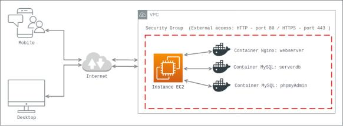

# NGINX + PHP + MariaDB + PhpmyAdmin (com Docker container)

Este projeto tem o objetivo de configurar um Webserver com Nginx, MariaDB e PhpmyAdmin utilizando 3 containeres Docker:

+ 1º - Container Docker com uma imagem customizada do Debian Buster.
+ 2º - MariaDB como Banco de dados
+ 3º - PhpmyAdmin para administração Web dos bancos de dados

...
## O Desenho da estrutura




O exemplo na imagem mostra uma instância EC2 da AWS. A instância esta conectada na VPC padrão e com as portas http/80 e http/443 liberadas para acesso externo.

IMPORTANTE: A porta tcp/3306 do MariaDB/MySQl não precisa ser exposta para a Internet. Logo, não é necessário inserir no Security group.

...
## Status


## Requirements

- [AWS/EC2] - Uma EC2 instalada e funcionando. (Pode ser utilizado em um computador local, mas sem o certificado SSL para o Nginx.)
- [Docker](https://www.docker.com/)
- [Docker Compose](https://docs.docker.com/compose/)


- ### Setup


#### Docker
##### CentOS
```sh
$ sudo yum -y update && sudo yum -y install curl && curl -fsSL https://get.docker.com | bash
```
##### Debian/Ubuntu
```sh
$ sudo apt-get -y update && sudo apt-get -y install curl && curl -fsSL https://get.docker.com | bash
```

#### Docker Compose
```sh
$ sudo curl -L "https://github.com/docker/compose/releases/download/1.27.4/docker-compose-$(uname -s)-$(uname -m)" -o /usr/local/bin/docker-compose
$ sudo chmod +x /usr/local/bin/docker-compose
$ sudo ln -s /usr/local/bin/docker-compose /usr/bin/docker-compose
```

### Docker image

A [image](https://hub.docker.com/r/linuxsolutions/server-web-nginx-php-fpm) ready to build your web server with Nginx and PHP-FPM.

* [Nginx 1.19.0](https://www.nginx.com/) - Web server!
* [PHP 7.4.18](https://www.php.net/) - Wordpress core Language
* [Composer 2.0.13](https://getcomposer.org/doc/00-intro.md) - Package Management
* [WP-CLI](https://developer.wordpress.org/cli/commands/) - WordPress Command Line

## Settings

The Directory `nginx/common` have all config files for Nginx

| File | About |
| ------ | ------ |
| acl.conf | Restricting Access to Proxied TCP Resources. |
| locations.conf | Define application location and access settings and ACME Cert | 
| php.conf | PHP upstream file  |
| security.conf | Wordpress security file |
| webp.conf | Settings file to allow changing the image format to WEBP |
| wpcommon.conf | Settings file for Wordpress Applications |
| wpsubdir.conf | Setting to enable multi-site WordPress based on subdirectories. |
| wpce-php.conf | PHP configuration supporting Plugin [Cache Enabled.](https://wordpress.org/plugins/cache-enabler/) |
| wpfc-php.conf | PHP configuration supporting Plugin [Fast CGI.](https://wordpress.org/plugins/nginx-cache/) |
| wprocket-php.conf | PHP configuration supporting Plugin [WP Rocket.](https://wpengine.com/solution-center/wp-rocket/#:~:text=WP%20Rocket%20is%20a%20premium,users%20as%20well%20as%20beginners.) |
| wpsc-php.conf | PHP configuration supporting Plugin [Super cache.](https://br.wordpress.org/plugins/wp-super-cache/) |

...
## Default settings and performance

The Directory `nginx/conf.d` configuration, performance and security files for the webserver and WordPress application.

...
- #### docker-nginx-php7/nginx/sites-enabled/

O diretório `nginx/sites-enabled` contém os arquivos de configuração do virtual host:

`example.com`
```conf
server {
    listen   80; ## listen for ipv4; this line is default and implied
    listen   [::]:80 default ipv6only=on; ## listen for ipv6

    root /var/www/html;
    index index.php index.html index.htm index.nginx-debian.html;

    # Make site accessible from http://localhost/
    server_name _;

    # Disable sendfile as per https://docs.vagrantup.com/v2/synced-folders/virtualbox.html
    sendfile off;

    # Security - Hide nginx version number in error pages and Server header
    server_tokens off;

    # Add stdout logging
    error_log /dev/stdout info;
    access_log /dev/stdout;

    location / {
        # First attempt to serve request as file, then
        # as directory, then fall back to index.html
        try_files $uri $uri/ =404;
    }

    # redirect server error pages to the static page /50x.html
    #
    error_page   500 502 503 504  /50x.html;
    location = /50x.html {
        root   /var/www/html;
    }

    # pass the PHP scripts to FastCGI server listening on socket
    #
    #include common/acl.conf;
    location ~ \.php$ {
        try_files $uri =404;
        fastcgi_split_path_info ^(.+\.php)(/.+)$;
        fastcgi_pass unix:/run/php/php7.4-fpm.sock;
        fastcgi_index index.php;
        include fastcgi_params;
        fastcgi_param SCRIPT_FILENAME $document_root$fastcgi_script_name;
        fastcgi_param PATH_INFO $fastcgi_path_info;
    }

        location ~* \.(jpg|jpeg|gif|png|css|js|ico|xml)$ {
                expires           5d;
        }

    # deny access to . files, for security
    #
    location ~ /\. {
            log_not_found off;
            deny all;
    }

    location = /favicon.ico {
    return 204;
    access_log     off;
    log_not_found  off;
    }

    include common/locations.conf;
    #include common/file_configuration.conf;

}
```

...
- ##### PHP
The directory `php` contains the archieve `php.ini` for change PHP configuration.


## Running

```sh
$ cd /path/docker-nginx-php7 && docker-compose up -d
```
* Container named: `webserver`.

> Note: Verify the deployment by navigating to your server address in
your preferred browser.

```sh
127.0.0.1
```

## Configure SSL

Antes de executar o container abaixo, certifique-se de editar do virtual host e adicionar o _include common/ssl.conf;_ no final do arquivo.


Edit:

`nginx/sites-enabled/default.conf`

```
server {
    listen   80; ## listen for ipv4; this line is default and implied
    listen   [::]:80 default ipv6only=on; ## listen for ipv6

    root /var/www/html;
    index index.php index.html index.htm index.nginx-debian.html;

    # Make site accessible from http://localhost/
    server_name _;

    # Disable sendfile as per https://docs.vagrantup.com/v2/synced-folders/virtualbox.html
    sendfile off;

    # Security - Hide nginx version number in error pages and Server header
    server_tokens off;

    # Add stdout logging
    error_log /dev/stdout info;
    access_log /dev/stdout;

    location / {
        # First attempt to serve request as file, then
        # as directory, then fall back to index.html
        try_files $uri $uri/ =404;
    }

    # redirect server error pages to the static page /50x.html
    #
    error_page   500 502 503 504  /50x.html;
    location = /50x.html {
        root   /var/www/html;
    }

    # pass the PHP scripts to FastCGI server listening on socket
    #
    #include common/acl.conf;
    location ~ \.php$ {
        try_files $uri =404;
        fastcgi_split_path_info ^(.+\.php)(/.+)$;
        fastcgi_pass unix:/run/php/php7.4-fpm.sock;
        fastcgi_index index.php;
        include fastcgi_params;
        fastcgi_param SCRIPT_FILENAME $document_root$fastcgi_script_name;
        fastcgi_param PATH_INFO $fastcgi_path_info;
    }

        location ~* \.(jpg|jpeg|gif|png|css|js|ico|xml)$ {
                expires           5d;
        }

    # deny access to . files, for security
    #
    location ~ /\. {
            log_not_found off;
            deny all;
    }

    location = /favicon.ico {
    return 204;
    access_log     off;
    log_not_found  off;
    }

    include common/locations.conf;
    include common/ssl.conf; ## Adiciona HTTPS e SSL ao Nginx
    #include common/file_configuration.conf;

}
```


O arquivo nginx/common/ssl.conf

```ssl-conf

  listen 443 ssl http2;
  listen [::]:443 ssl http2;

  ssl_certificate /etc/letsencrypt/live/example.com/fullchain.pem;
  ssl_certificate_key /etc/letsencrypt/live/example.com/privkey.pem; 

```


Então execute:

```sh
docker-compose -f docker-compose-ssl.yml up
```


Configure Cron renew:

Execute:

```sh
$ crontab -e
```

```sh
0 0 */15 * * docker-compose -f /path/docker-nginx-php7/docker-compose-ssl.yml up && docker kill -s HUP webserver >/dev/null 2>&1
```

